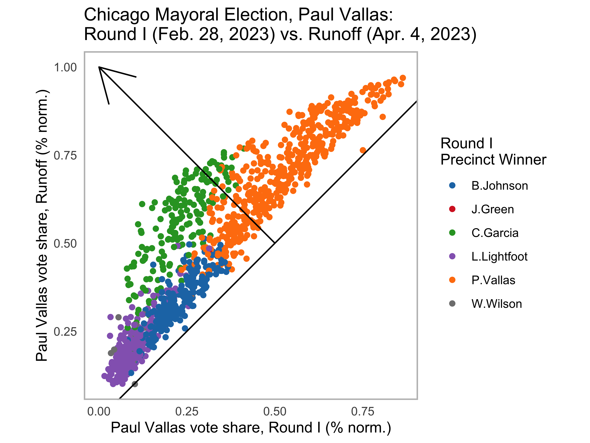
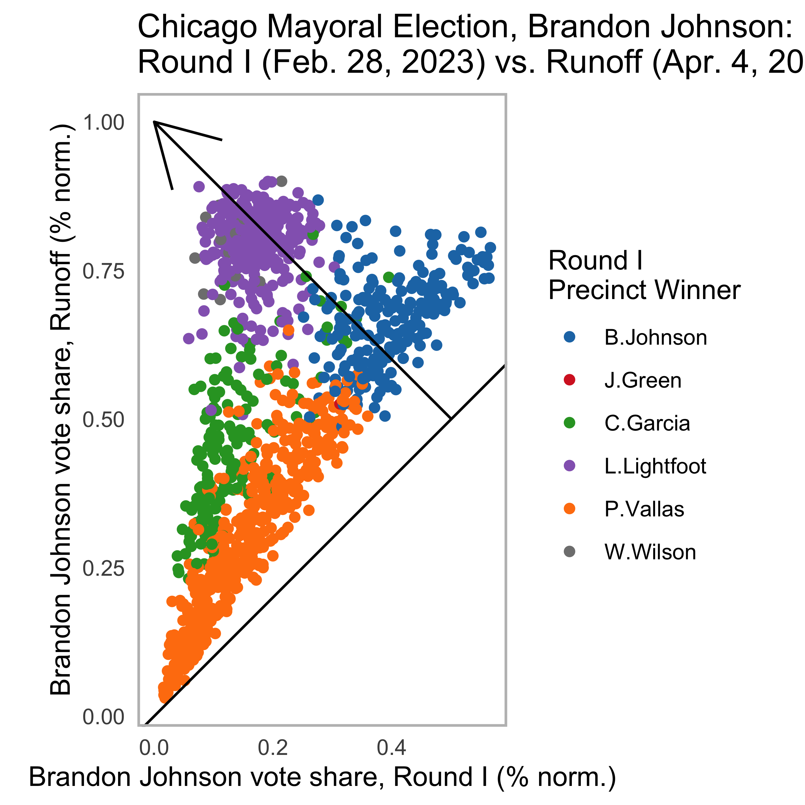
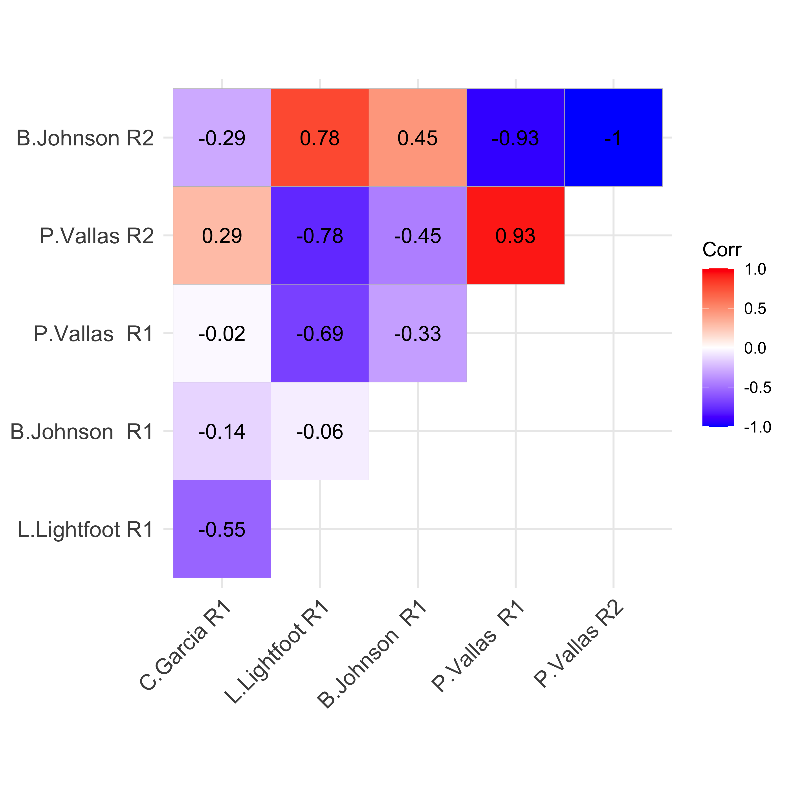
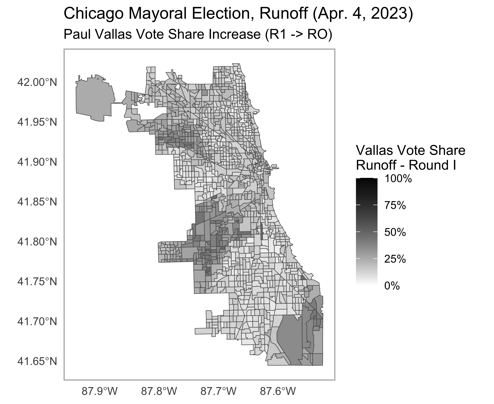
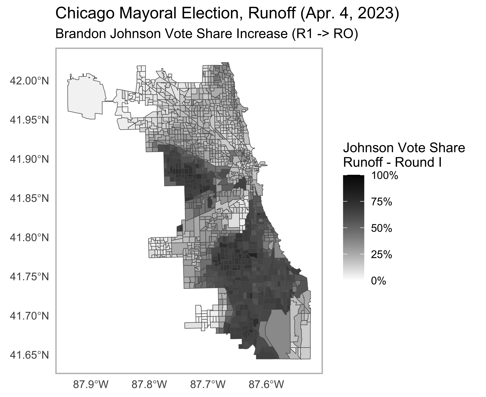

### Introduction

Chicago elects its mayors in a two-round system. Candidates of all parties compete together in the first round, and the top two vote earners move forward to a runoff. This year the first round took place on February 28th, and the incumbent mayor, Lori Lightfoot, did not win enough votes to move forward (coming in third place). Instead, Paul Vallas (32.90%) and Brandon Johnson (21.63%) advanced to the runoff (with Lightfoot at 16.81%). On April 4th,   Johnson won the runoff election against Vallas (51.44% - 48.56%), despite previously finishing in a distant second place. In this post, I will explore Johnson's path to victory. Bear with me, as the results are not fully tallied (92% counted) as I write this, but the takeaways should remian the same. 

### Clues Left Behind by the First Round of Voting

After the first round of voting, I was not confident that Johnson would win the runoff due to his >10% trail in the first round. However prior to the runoff taking place, I did identify some promising data that could signify his victory. Reviewing the results from Round I, several of the leading candidates carved out regions of popularity:

Going into the runoff, the major standing question was "how are the voters who supported Lori Lightfoot, Chuy Garcia, and other minor candidates going to align in the two person race?" To answer this question, I first conducted a correlation analysis between the different candidates' performances. I identified a strong negative correlation between the performances of Lightfoot and Vallas: where Lightfoot did well Vallas did poorly and vice versa (r=-0.69). 

Next, precincts were considered in terms of their support for Vallas and Johnson in the first round. Points located above the Vallas-Johnson line represent precincts that supported Johnson more than Vallas and vice versa for below. Interestingly, nearly all of the Lightfoot-won precincts broke for Johnson over Vallas. The positioning of the Lightfoot cluster in the bottom-left section of the graph indicates that both Vallas and Johnson did not receive many votes in these precincts, but Johnson was clearly favored. 

Before the second round, it was difficult to determine if the favoring of Johnson over Vallas among those who did not support Lightfoot would be an indication of how Lightfoot voters would select their second choice candidate in the runoff. Voters in as small a unit as precincts can sometimes be viewed as homogenous groups, in which case the Johnson-edge could be informative. However, the existence of divergent factions where Lightfoot and Johnson voters possess different ideology is possible.

### Analysis from the Runoff Election

Now that we have the results of the runoff, the data corroborates the former theory that Vallas' poor pefromance in the Lightfoot-won districts during round I was a harbinger for his eventual loss. Vallas and Johnson's performances were both analyzed by comparing the votes received by each candidate in the subsequent elections. Points representing precincts are colored indicating the first round winner, and gains made by the candidate are shown as points trend towards the top left section of the graph. 

Vallas made gains in the precincts previoulsy won by Chuy Garcia. Johnson received incredible increases across the board, especially in the precincts that originally went for Lightfoot.

This trend is further exhibited when Vallas and Johnson's second round results are added to the correlation matrix. A strong positive correlation is exhibitted between Lightfoot's Round I performance and Johnson's Round II performance (r = 0.78), indicating massive shifts of the Lightfoot voter bloc to Johnson. The negative correlation between Lightfoot Round I becomes even more extreme with Vallas Round II (r = -0.78). Notably, Vallas has a strong correlation between his first and second round coalitions (r = 0.93). On the other hand, Johnson possesses a much weaker correlation (r = 0.45). This difference is indicative that Johnson heavily absorbed votes from his prior first round contenders.

Lastly, I generated two maps to show areas where Vallas and Johnson's vote shares increased between the first round and runoff. You can see the areas where Johnson made major gains in the previously Lightfoot-won territory. 

### Code 

Code for this project was written entirely in R. 

[Click here](https://github.com/scepstein/scepstein.github.io/tree/main/code/Midterms_Media) to view all the code used to produce the analysis and visualizations. 

### Data Sources

[Chicago Board of Elections, election results](https://chicagoelections.gov/en/election-results.html)

[City of Chicago, data precinct shapefile](https://data.cityofchicago.org/Facilities-Geographic-Boundaries/Boundaries-Wards-2023-Map/cdf7-bgn3)

