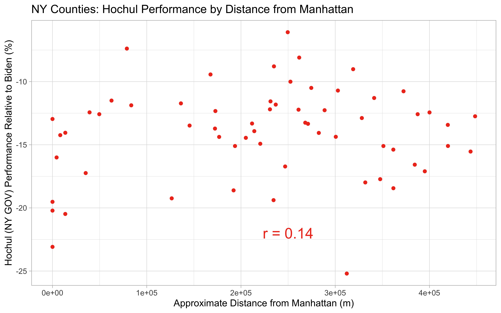

### Introduction

Chicago elects its mayors in a two-round election system. In the first round, candidates of all parties compete against each other, and the top two vote earners move forward to a runoff election, in which everyone votes again several weeks later. In 2023, the first round of voting took place on February 28th, and the incumbent mayor, Lori Lightfoot, did not win enough votes to move forward to the runoff (coming in 3rd place in the crowded field). Instead, Paul Vallas (32.90%) and Brandon Johnson (21.63%) moved forward to the runoff (with Lightfoot at 16.81%). On April 4, 2023, Brandon Johnson defeated Paul Vallas in the runoff election (51.44% - 48.56%), despite being the distant second place finisher in the first round. In this post, I will explore detailed analysis on Johnson's path to victory. Bear with me, as the election results are not completely tallied (92% counted) at this time, but the overall takeaways should be more or less the same with the completed results. 

### Clues Left by the First Round of Voting

Going into the runoff election, I had already reviewed some of the data from the first round of voting. I was not particularly confident in Johnson's ability to win the runoff due to his >10% trail in the first round, but I did identify some writing on the wall that could have (and did) amount to his eventual victory. Looking at a map of precinct winners from the first round, several of the leading candidates carved out regions of popularity.


One of the leading questions going into the runoff election was "how are the voters who supported Lori Lightfoot, Chuy Garcia, and other candidates going to align in the two person race?" The first attempt at answering this question was by conducting a correlation analysis between the different candidates' performances across the various precincts. Here, I was able to identify a strong negative correlation between the performances of Lightfoot and Vallas: where Lightfoot did well Vallas did poorly and vice versa (r=-0.69). 


To investigate further, an analysis of all of the precincts were considered in terms of Vallas and Johnson support in the first round. Any points above the Vallas-Johnson interface indicate precincts that supported Johnson more than Vallas and vice versa for below. Interestingly, nearly all of the Lightfoot-won precincts break for Johnson over Vallas. The positioning of the cluster in the bottom left section of the graph indicates that both Vallas and Johnson did not get much of the vote here, but Johnson was clearly favored. Before the runoff election, this left me with two competing theories: either (A) the greater support for Johnson over Vallas among non-Lightfoot voters in the Lightfoot-won districts is indicative that Johnson is the preferable second choice to Lightfoot overall in these districts or (B) the Lightfoot and non-Lightfoot contigencies will act completely independent of each other and all the Lightfoot voters could swing to Vallas in the runoff.


### Introduction

In this blog post, I plan to use the R programming language to analyze the results of the 2022 Midterm elections in New York, Connecticut, and Pennsylvania. I will compare county and town election results from the 2020 presidential election to senatorial and gubernatorial elections in 2022. Further, I look at the impact of geospatial media markets on election results in these states. Through generation of maps and data plots, I hope to identify any connections between common media presence and trends in election results. 

### Code and Packages Used

RStudio was used as the IDE for this project. The entire project was analyzed using the R programming language. Data in csv, json, and shp file types were analyzed. The following R packages were used: rgdal, sf, rjson, ggplot2, and cowplot.

[Click here](https://github.com/scepstein/scepstein.github.io/tree/main/code/Midterms_Media) to view all the code used to produce analysis and visualizations below. 

### Data Disclosue

I have produced all of the visualizations shown below and links to the corresponding code are included above. All data that was retrieved from outside sources is referenced at the end of the article. 

## Analysis and Results

#### Midterm Elections

In the United States, midterm elections are held halfway through each presidential term; they provide the public with the opportunity to reshape most federal and state offices through democratic process. Historically, the political party that the President represents will face an unfavorable environment in the midterms, which frequently results in large losses for that party. One popular theory as to why this occurs is that the segment of the public that opposes the actions and ideology of the incumbent president will turnout to vote at a larger rate than the complacent supporters. Leading up to election day in 2022, the presidency is occupied by Joseph Biden, a Democrat, producing the expectation from historical precedent that the national environment is favorable to Republicans. Practically this means that Republican candidates are expected to do better, at the expense of their Democratic counterparts, shifting the outcomes primarily in races that are close. 

#### Results of 2022

With the results of the November 8th elections almost completed, Democrats appear to have performed much better than what was expected from historical precedent. Losses for Democrats in key U.S. House, U.S. Senate, and state governors' races were kept to a minimum. However, this trend was not observed ubiquitously throughout the nation. Democratic New York governor Kathy Hochul won her election by only 6 points. Statewide races are typically a lock for Democrats in New York, where former governor Andrew Cuomo won his previous election by 23 points in 2018, the same margin Joe Biden won the state by in 2020. Throughout the state, Democrats lost several U.S. House races that Biden had carried in 2020, while Democrats out of New York won in much more difficult terrain. 

#### What happened in New York?

The 2022 elections featured many unique candidates nationwide, which was likely responsible for several candidate-specific election outcomes. While candidate quality was likely a relevant factor in New York, the poor performance by Democratic candidates on all levels of the ballot is indicative of a larger systematic effect than individual candidate quality. One theory that I've come across relates to the effect of media in New York, particularly surrounding New York City. Proponents of the media bias theory claim that New York City based media, more so than media in other places, supports Republican ideology and talking points and ended up promoting Republican candidates in the midterm elections. As a result, I've gathered available data in order to determine if this theory is sensible. 

Firstly, I examined Hochul's performance statewide relative to Biden's 2020 presidential results, which will be used as a baseline. I also looked at Schumer's performance in his campaign for U.S. Senate (2022). Schumer is an extremely popular statewide elected, winning by 43 points in 2016 and 34 points in Republican-wave year 2010. In 2022, Schumer only carried the state by 12 points, suggesting that Hochul's candidate quality was not the only detractor for Democrats in the state. Both Schumer and Hochul under-performed Biden's electoral gains (by % of vote acquired) in all 62 counties. 


```r
#Code used to generate NYS maps
hochulcounties = subset(NYS, Hochul_v_Biden > 0)
NYS = st_transform(NYS, "EPSG:4269")

library(ggplot2)
main.plot = ggplot()+
  geom_sf(data=NYS, aes(fill = Hochul_v_Biden), size = 1.5)+
  scale_fill_gradient2(low = "red", mid = "white", high = "blue")+
  theme_light()+
  ggtitle("Hochul '22 vs. Biden '20 (Difference in percent of vote acquired)")+
  labs(subtitle = "Comparison of Hochul gubernatorial results '22 to Biden presidential results '20.")+
  labs(caption = "Hochul underperformed Biden in all counties.")+
  labs(fill = "Hochul performance \nrelative to Biden (%)")+
  geom_sf(data=hochulcounties, alpha = 0, size = 1.5, color = "blue")+
  theme(axis.text = element_text(size = 12))+
  theme(plot.title = element_text(size = 20))+
  theme(plot.caption = element_text(size = 14))+
  theme(plot.subtitle = element_text(size = 14))

inset.plot = ggplot()+
  geom_sf(data=NYS, aes(fill = Hochul_v_Biden), size = 1.5, show.legend = FALSE)+
  scale_fill_gradient2(low = "red", mid = "white", high = "blue")+
  theme_light()+
  theme(panel.grid.major = element_blank())+
  theme(axis.text = element_blank())+
  xlim(-74.3, -73.5) + ylim (40.5,41)+
  theme(plot.title = element_text(size = 12))+
  ggtitle("NYC metropolitan area")

library(cowplot)
final_plot = ggdraw() +
  draw_plot(main.plot) +
  draw_plot(inset.plot, x = 0.05, y = 0.11, width = 0.3, height = 0.25)
```
[Click here to see the rest of the code from this project](https://github.com/scepstein/scepstein.github.io/tree/main/code/Midterms_Media)

#### Pennsylvania shows a different story

As seen in several competitive battleground states across the country, where Republicans were predicted to have an edge, Democratic candidates produced many statewide victories, bucking historical precedent. In Pennsylvania, senatorial candidate John Fetterman (D) defeated challenger Mehemt Oz (R) and gubernatorial candidate Josh Shapiro (D) defeated challenger Douglas Mastriano (R), by much larger margins than the state has offered in recent Presidential elections to both parties. Shapiro out-performed Biden's margin in every county, winning the state by almost 15 points compared to Biden's 1 point victory. Fetterman outperformed Biden's margin in all but two counties: Pike and Monroe. Across the entire map, there appears to be a general trend that the further a county is located away from New York City, the larger over-performance by the 2022 Democratic candidates. 


```r
#Conversion of election results from json to R dataframe 
County = c(0)
for (x in 2:68){
  County[x-1] = PAvotes[["races"]][[1]][["reporting_units"]][[x]][["name"]]
}
rm(x)
PA_Senate = data.frame(County)
rm(County)

PA_Senate$Winner_votes = c(0)
PA_Senate$Loser_votes = c(0)
PA_Senate$Winner = c(0)
PA_Senate$Loser = c(0)

for (x in 2:68){
  PA_Senate$Winner_votes[x-1] = PAvotes[["races"]][[1]][["reporting_units"]][[x]][["candidates"]][[1]][["votes"]][["total"]]
  PA_Senate$Loser_votes[x-1] = PAvotes[["races"]][[1]][["reporting_units"]][[x]][["candidates"]][[2]][["votes"]][["total"]]
  PA_Senate$Winner[x-1] = PAvotes[["races"]][[1]][["reporting_units"]][[x]][["candidates"]][[1]][["nyt_id"]]
  PA_Senate$Loser[x-1] = PAvotes[["races"]][[1]][["reporting_units"]][[x]][["candidates"]][[2]][["nyt_id"]]
}
rm(x)

PA_Senate$Fetterman_votes = c(0)
PA_Senate$Oz_votes = c(0)

for (x in 1:length(PA_Senate$County)){
  if(PA_Senate$Winner[x] == "fetterman-j"){
    PA_Senate$Fetterman_votes[x] = PA_Senate$Winner_votes[x]
    PA_Senate$Oz_votes[x] = PA_Senate$Loser_votes[x]
  }
  if(PA_Senate$Winner[x] == "oz-m"){
    PA_Senate$Oz_votes[x] = PA_Senate$Winner_votes[x]
    PA_Senate$Fetterman_votes[x] = PA_Senate$Loser_votes[x]
  }
}
```
[Click here to see the rest of the code from this project](https://github.com/scepstein/scepstein.github.io/tree/main/code/Midterms_Media)

#### Southwestern Connecticut shifts rightward

To look at additional examples of the "proximity to New York City effect," we can look to one of New York's eastern neighbors: Connecticut. Across the state, we see a similar trend where the two Democratic incumbents, Lamont for Governor and Blumenthal for Senate, ran behind Biden's 2020 numbers almost across the board, but especially in the southwestern region of the state, which is closest in proximity to New York City.


#### The role of media

Designated media areas (DMAs) are geographic boundaries used to determine television and radio markets. Presumably, everyone in the same DMA is receiving the same news tailored to the culture of their geographic region. Mapped below, the New York City DMA contains small sections of Pennsylvania and Connecticut in addition to surrounding areas in New York and New Jersey. Notably, these sections include Pike County, PA and a portion of Southwestern Connecticut. These are the same areas where statewide Democratic candidates performed the worst relative to Biden's 2020 numbers. 


Connecticut provides election results by township, so we have increased granularity to visualize regions inside and outside the NYC DMA. In both statewide races, the median township in the New York City market featured a worse performance for Democrats than the 25th percentile in the Hartford and New Haven market that covers the rest of the state. In addition to the strong negative outliers present in the NYC media market, these plots support the trends suggested by the map data.  


#### Influence from the big city

The maps generated thus far have suggested proximity to New York City relates to electoral performance in Pennsylvania and Connecticut. I generated some correlation plots to determine how strong the correlation is. 

```r
#Code used to calculate distance between each PA county and Manhattan 
manhattan = subset(NYS, NAME == "New York")

PA$Manhattan_dist = c(0)
for (x in 1:length(PA$COUNTY_NAM)){
  PA$Manhattan_dist[x] = st_distance(manhattan, PA[x,])[1,1]
}
```
[Click here to see the rest of the code from this project](https://github.com/scepstein/scepstein.github.io/tree/main/code/Midterms_Media)

Firstly, within New York States there was no apparent correlation between proximity to Manhattan and either Schumer or Hochul's performances (r = 0.1 and 0.14, respectively), suggesting the statewide issues these two candidates faced were unrelated to media or culture unique to NYC.




In Pennsylvania, the correlation was more significant (r = 0.52 for Shapiro and 0.61 for Fetterman). Across the state, Fetterman and Shapiro performed better in the Western part of the state, in almost all counties with better performances than Biden's 2020 numbers. In both cases, the worst two preforming counties are among the closest. 


Similar to before, Connecticut displays an interesting regional effect. Well displayed in Blumenthal's plots, towns within 100 km of Manhattan featured a strong correlation (r = 0.69) between proximity and electoral performance. Beyond 100 km, the effect is more or less lost (r = 0.18), yielding the full data set an r value of 0.43. Lamont's governor results are less pronounced but the two regions still persist (r = 0.53, 0.25, and 0.34, respectively).


#### Conclusions

While the role of media markets seemed to have little effect on differentiating the relatively poor performances of Hochul and Schumer in different regions throughout New York State in 2022, the small sections of Pennsylvania and Connecticut that are present in New York City's media market appear to have significantly worse performance for Democrats than other regions of the respective states. The role of media is definitely one possibility to consider. Additionally, these regions with close proximity to New York City likely feature differing demography and culture compared to the remaining part of each state. That is to emphasize that correlation may not reflect causation necessarily. The counties and towns included in the New York City media market are done so because the NYC metropolitan area has great influence and relevance in these regions, grouping them by cultural similarity. While there are many factors to consider, it is interesting to see the potential influence NYC has on elections in neighboring states. 

### Data Sources

[National map of designed market areas (DMAs)](https://datablends.us/2021/01/14/a-useful-dma-shapefile-for-tableau-and-alteryx/)

[Shapefile of New York counties](https://gis.ny.gov/gisdata/inventories/details.cfm?DSID=927)

[Shapefile of Pennsylvania counties](https://www.pasda.psu.edu/uci/DataSummary.aspx?dataset=24)
 
[Shapefile of Connecticut counties](https://catalog.data.gov/dataset/tiger-line-shapefile-2019-state-connecticut-current-county-subdivision-state-based)

[Pennsylvania election results, 2022](https://www.nytimes.com/interactive/2022/11/08/us/elections/results-pennsylvania.html)

[Pennsylvania election results, 2020](https://en.wikipedia.org/wiki/2020_United_States_presidential_election_in_Pennsylvania)

[New York election results, 2022](https://www.nytimes.com/interactive/2022/11/08/us/elections/results-new-york.html)

[New York election results, 2020](https://en.wikipedia.org/wiki/2020_United_States_presidential_election_in_New_York)

[Connecticut election results, 2022](https://www.nytimes.com/interactive/2022/11/08/us/elections/results-connecticut.html)

[Connecticut election resutls, 2020](https://www.nbcconnecticut.com/news/politics/decision-2020/town-by-town-results-how-did-connecticut-vote-in-the-2020-presidential-election/2355898/)

### Disclaimer

Vote totals were taken as reported before official results were certified, so the finalized numbers may be slightly different than what is presented here. 
