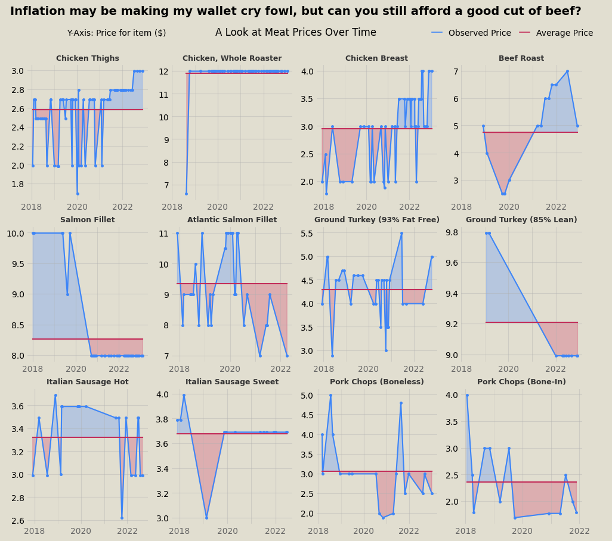
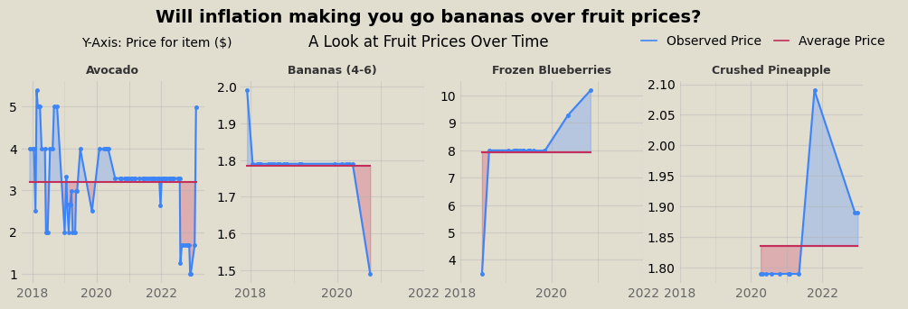
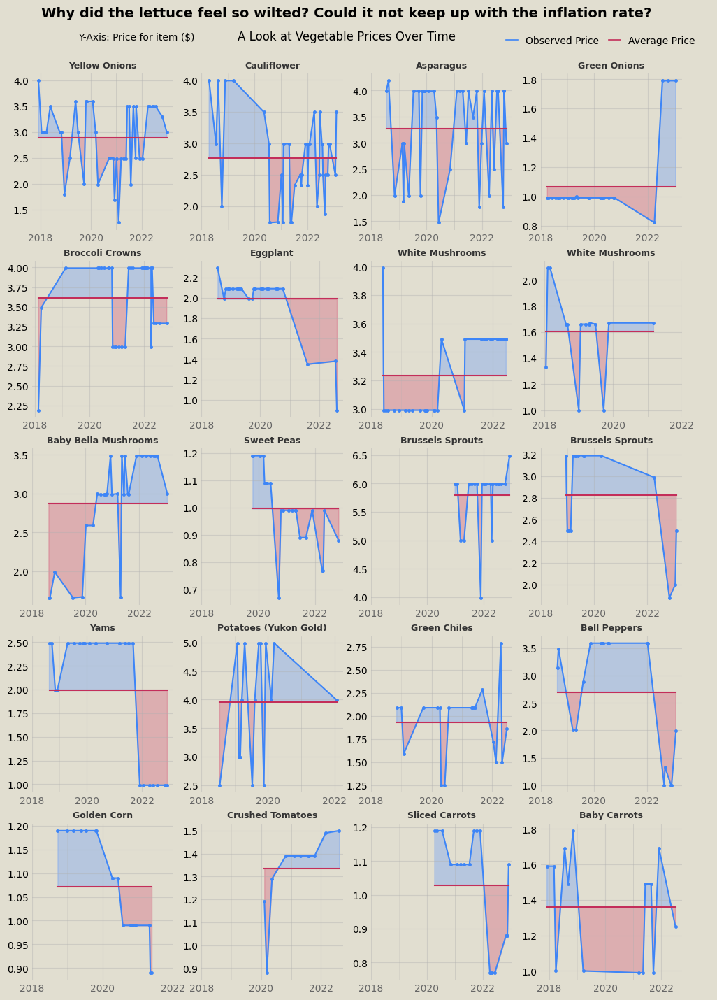
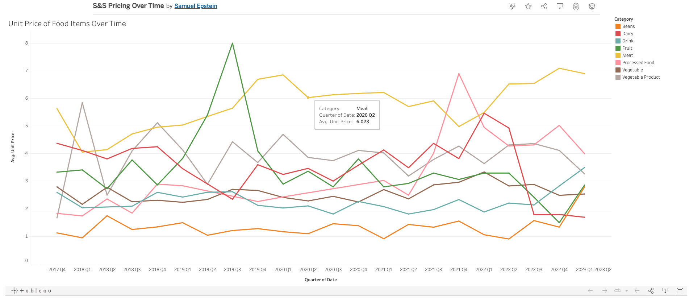
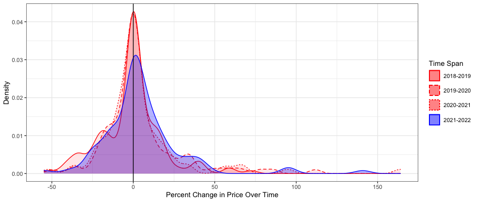
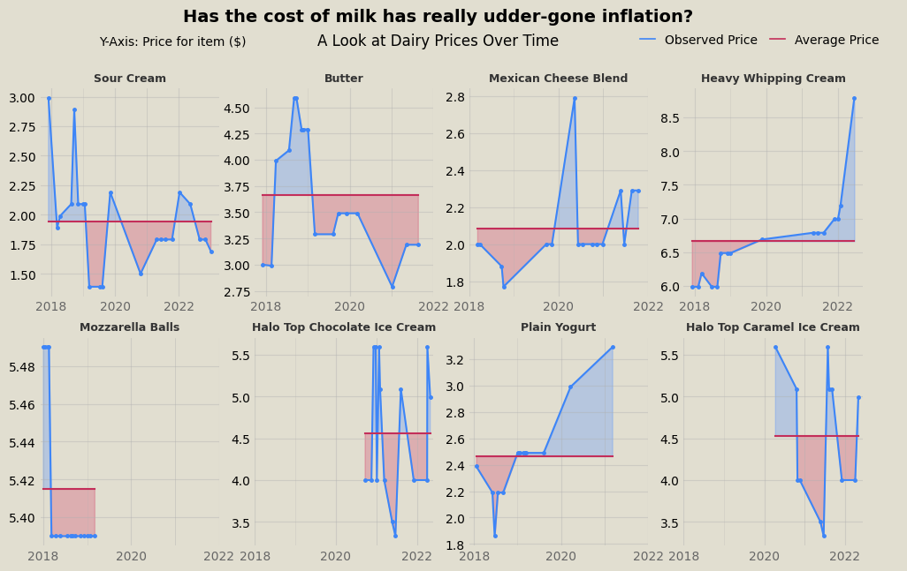
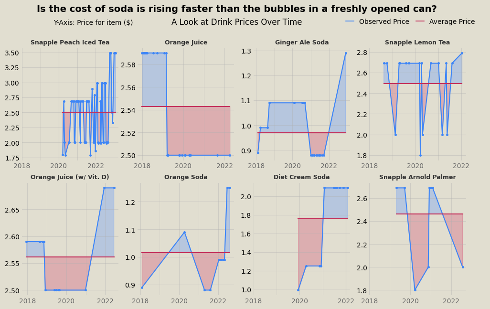

#### TLDR: 
Five years of my friend's online Stop and Shop receipts were scraped using a Python script to collect data on the price of groceries over time to measure the impact of inflation. Plots and analysis using Python, R, and Tableau try to answer the question: how serious is the impact of inflation?

### Introduction 
The topic of economic inflation rears its ugly head in the national discussion on politics and wellbeing every now and again and has remained a pertinent issue for many Americans over the past year. As the costs of goods and services increase across the market, the burden is passed onto the consumer to make up the difference. Using a trove of grocery data, I was able to track the costs of groceries by item over time in order to determine if the effects of inflation produced any noticeable impact on his expenses. While the scope of the data remains limited to foods my friend likes to eat, the study tracks the prices of hundreds of distinct product items purchased multiple times over the past five years.

### Designing a Scraper to Collect Individual Item Data
With a collection of online grocery receipts, each saved as an HTML file, I prepared a script that can parse through each file and extract data pertaining to individual items purchased and the unit cost of the specified item. I used the library BeautifulSoup to aid HTML parsing and pandas to construct a dataframe with the resulting extracted data. I identified a unique class tag which would signal that the div element with that tag contained all the data we need to fetch on each item. Therefore, I was able to collect information on the item name, quantity purchased, and unit price for each item listed on each receipt. The script I wrote is shown below:

```python
for j in file_list:
    with open(j, "r") as f:
        contents = f.read()
    soup = BeautifulSoup(contents, "html.parser")

    #Identify elements containing info for each groceries
    list = []
    for x in range(0, len(soup.find_all('div'))):
        if soup.find_all('div')[x].has_attr("class"):
            if "order-history-list_item" in soup.find_all('div')[x]['class']:
                list.append(soup.find_all('div')[x])

    list = [l for l in list if len(l.findAll('span')) == 0] #Excludes items that are substitutions because they're coded differently 

    #Isolate data of interest
    image_code = [v.find_all('img')[0]['src'] for v in list]
    quantity =  [v.find_all('div')[2].find_all("div")[0].find_all("div")[0].text.strip().split(" x ")[0] for v in list]
    unit_price = [float(v.find_all('div')[2].find_all("div")[0].find_all("div")[0].text.strip().split(" x ")[1].split(" ea.")[0].split("$")[1]) for v in list]
    item_name = [v.find_all('div')[2].find_all("div")[0].find_all("div")[1].text.strip() for v in list]
    date = [pd.to_datetime(j.split("/")[5].split('.html')[0], format = "%Y-%m-%d") for v in range(len(list))]

    #Combine into df
    if file_list.index(j) == 0:
        df = pd.DataFrame({"image_code": image_code, "quantity": quantity, "unit_price": unit_price, "item_name": item_name, "date": date})
    if file_list.index(j) > 0:
        df = pd.concat([df, pd.DataFrame({"image_code": image_code, "quantity": quantity, "unit_price": unit_price, "item_name": item_name, "date": date})], ignore_index=True)
```
### Visualizations Galore
Code for several of the visualizations shown below is available [here.](https://github.com/scepstein/scepstein.github.io/tree/main/code/stopandshopinflation)

Among the first visualizations I made from the trove of data involved isolating some of the most frequently purchased items (thus featuring a robust representation of price differences over time). First, I plotted the prices of 12 of the most popular meat items over time. In these graphs, the price at a given point is compared to the average price over the entire time window, so blue area corresponds to the price being above average and red area is below average. No clear inflationary trend persists across the meat data.



Similarly, fruit and veggies don't exhibit inflationary trends either, at least wholistically. Some items are at all time high prices in the past year, while others all time lows. 




For similar visualizations with dairy products and drinks, see the end of the post. 

Using Tableau, I created an interactive visualization, which can be accessed [here.](https://public.tableau.com/app/profile/samuel.epstein/viz/SSPricingOverTime/Veggie2?publish=yes) In the graph, food seperated by category is averaged over three month increments to identify signficant trends among similar foods. The Tableau model is interactive and provides tool tips with information on each point. A screenshot of the Tableau figure is shown below. 


Lastly, I prepared a script in R to caluculate year-to-year inflation rates across all product items. The script would identify any product that was purchased at least once per year in a span of subsequent years (e.g., 2018-2019, 2019-2020, etc.) and calculate the average price change over that time. The script is shown below.

```r
library(lubridate)
groceries$date = ymd(groceries$date)
groceries$year = year(groceries$date)

library(dplyr)
datasummary = group_by(groceries, item_name, year) %>%
  summarise(avg_price = mean(unit_price)) 

yearbyyear = data.frame(unique(datasummary$item_name))
colnames(yearbyyear) = c("item")
yearbyyear$TO18_19 = c(NA)
yearbyyear$TO19_20 = c(NA)
yearbyyear$TO20_21 = c(NA)
yearbyyear$TO21_22 = c(NA)

year_percent_difference = function(year1, year2, col) {
  if(year1 %in% dummy$year & year2 %in% dummy$year){
    yearbyyear[[col]][x] <<- (dummy$avg_price[match(year2, dummy$year)] - dummy$avg_price[match(year1, dummy$year)]) * 100 / dummy$avg_price[match(year1, dummy$year)]
  }
}

for (x in 1:length(yearbyyear$item)){
  dummy = subset(datasummary, item_name == yearbyyear$item[x])
  for (r in 0:3){
  year_percent_difference(2018+r, 2019+r,  colnames(yearbyyear)[2+r])
  }
}

tally = data.frame(c("'18 to '19", "'19 to '20", "'20 to '21", "'21 to '22"))
colnames(tally) = c("Year Range")
tally$averagechange = c(NA)
for (y in 0:3){
  tally$averagechange[y+1] = mean(yearbyyear[[colnames(yearbyyear)[2+y]]], na.rm = TRUE)
  tally$sd[y+1] = sd(yearbyyear[[colnames(yearbyyear)[2+y]]], na.rm = TRUE)
  tally$n[y+1] = sum(yearbyyear[[colnames(yearbyyear)[2+y]]], na.rm = TRUE) / mean(yearbyyear[[colnames(yearbyyear)[2+y]]], na.rm = TRUE)
  tally$SE[y+1] = tally$sd[y+1] / sqrt(tally$n[y+1])
}
```
The collected data was then graphed in a histogram-type density plot to visualize the frequency and distribution of price changes for all the products featured in the two-year time span increments. As shown below, the first three spans (2018-2019, 2019-2020, and 2020-2021) yield similar curves that peak right at x=0 (percent change in price between the first year and second year), indicating that a good's price most commonly does not change between the first and second year of the span. The curve yielded by the fourth span (2021-2022) is notably shorter than the others and right-shifted, indicating that deviations from the most common output are more frequent and values trend more towards price increases. These two characteristics of the 2021-2022 curve are indicative of an increase in the number of products featuring price increases over this span, relative to previous spans. As a result, the shift suggests that inflation had a noticeable effect on food prices increasing from 2021 to 2022 that was not clearly detected in the prior visualizations that relied more on cherry picking items of interest.



Further visualizations for dairy and drinks:


